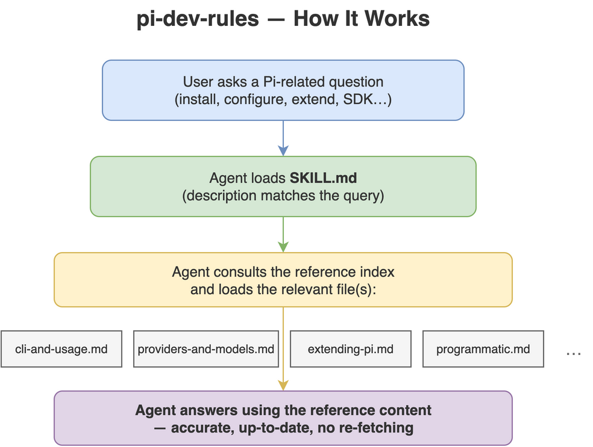

# pi-dev-rules

[](LICENSE)
[](https://github.com/Agents365-ai/pi-dev-rules/stargazers)
[](https://github.com/Agents365-ai/pi-dev-rules/network/members)
[](https://github.com/Agents365-ai/pi-dev-rules/releases/latest)
[](https://github.com/Agents365-ai/pi-dev-rules/commits/main)

[](https://agentskills.io)

**English** · [中文](README_CN.md)

A coding-agent skill that packages the **latest [Pi](https://pi.dev) documentation**
(`@earendil-works/pi-coding-agent`) as an on-demand reference, so an agent can install, configure,
run, and **extend Pi** without re-fetching the docs.

Mirrors <https://pi.dev/docs/latest> (fetched 2026-07-17).

Works with Claude Code, Cursor, Codex, Copilot, Windsurf, Cline / Roo Code, Gemini CLI,
Aider, Zed, OpenCode, OpenClaw / ClawHub, Hermes, pi-mono — plus major Chinese agents
(Trae, Qwen Code / Tongyi Lingma, Baidu Comate, CodeGeeX) — and any agent that reads
`AGENTS.md` or the [Agent Skills](https://agentskills.io) format.

<p align="center">
  
</p>

## What's inside

- `SKILL.md` — overview, when-to-use, cheat sheet, hard rules, reference index.
- `references/cli-and-usage.md` — install, auth, CLI flags, slash commands, message queue, context
  files, env vars, sessions, keybindings.
- `references/providers-and-models.md` — providers (30+), `auth.json` (+ scoped `env`), cloud
  providers, custom `models.json`, `compat`, custom-provider extensions.
- `references/settings-and-compaction.md` — `settings.json` (trust/analytics/retry/transport),
  auto/manual compaction, branch summaries.
- `references/extending-pi.md` — extensions API, skills (SKILL.md), prompt templates, themes, packages.
- `references/tui-components.md` — TUI component system for custom extension/tool UIs.
- `references/security-and-containerization.md` — project-trust model, no built-in sandbox, Gondolin
  micro-VM, Docker, OpenShell.
- `references/session-format.md` — session JSONL schema, message/entry types, SessionManager API.
- `references/programmatic.md` — SDK, RPC mode, JSON event-stream mode.
- `references/platform-setup.md` — Windows, Termux, tmux, per-terminal setup, shell aliases,
  build-from-source.
- `references/development.md` — building Pi from source, monorepo structure, forking/rebranding,
  debugging.
- `references/packages-catalog.md` + `references/pi-packages.csv` — full pi.dev package gallery
  (5,249 packages) as a queryable manifest, plus `scripts/fetch-pi-packages.py` to refresh it.

## Install

| Platform | Path |
| ---------- | ------ |
| Claude Code (global) | `~/.claude/skills/pi-dev-rules/` |
| Claude Code (project) | `.claude/skills/pi-dev-rules/` |
| OpenClaw (global) | `~/.openclaw/skills/pi-dev-rules/` |
| Pi (global) | `~/.pi/agent/skills/pi-dev-rules/` |
| Pi (project) | `.pi/skills/pi-dev-rules/` |

```bash
cp -r pi-dev-rules ~/.claude/skills/      # example: Claude Code, global
```

## Updating

Re-fetch the pages under <https://pi.dev/docs/latest> and regenerate the `references/` files; bump
`metadata.fetched` in `SKILL.md`.

## Support

If this project helps you, consider supporting the author:

<table>
  <tr>
    <td align="center">
      
      <br>
      <b>WeChat Pay</b>
    </td>
    <td align="center">
      
      <br>
      <b>Alipay</b>
    </td>
    <td align="center">
      
      <br>
      <b>Buy Me a Coffee</b>
    </td>
    <td align="center">
      
      <br>
      <b>Give a Reward</b>
    </td>
  </tr>
</table>

## Author

**Agents365-ai**

- Bilibili: <https://space.bilibili.com/441831884>
- GitHub: <https://github.com/Agents365-ai>

## License

[MIT](LICENSE)
