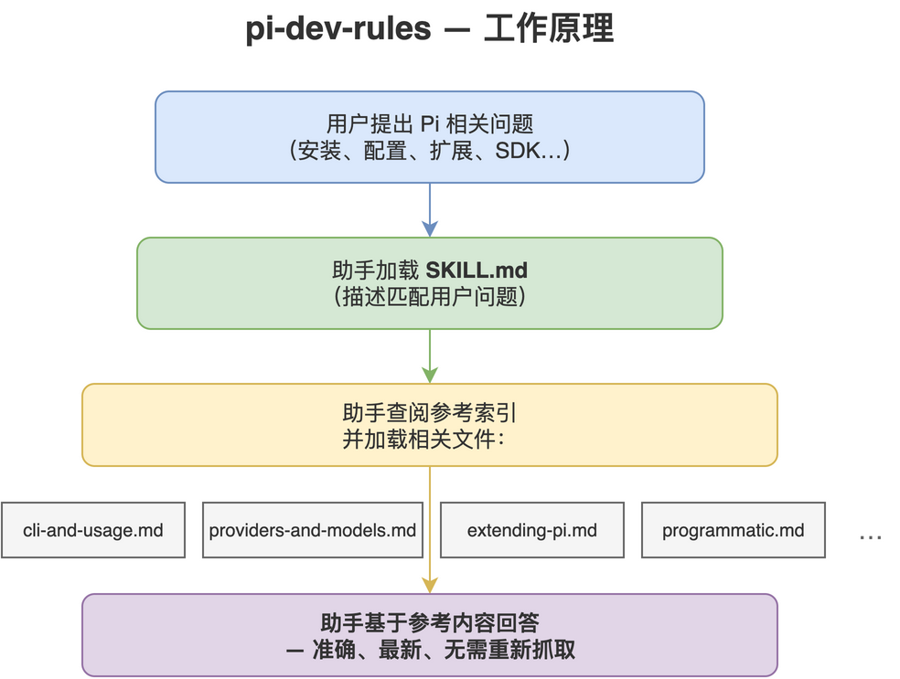

# pi-dev-rules

[](LICENSE)
[](https://github.com/Agents365-ai/pi-dev-rules/stargazers)
[](https://github.com/Agents365-ai/pi-dev-rules/network/members)
[](https://github.com/Agents365-ai/pi-dev-rules/releases/latest)
[](https://github.com/Agents365-ai/pi-dev-rules/commits/main)

[](https://agentskills.io)

中文 · [English](README.md)

一个编程助手技能，将最新的 [Pi](https://pi.dev) 文档（`@earendil-works/pi-coding-agent`）
打包为按需参考库，让助手无需重新抓取文档即可安装、配置、运行和**扩展 Pi**。

镜像 https://pi.dev/docs/latest（抓取日期：2026-07-16）。

适用于 Claude Code、Cursor、Codex、Copilot、Windsurf、Cline / Roo Code、Gemini CLI、
Aider、Zed、OpenCode、OpenClaw / ClawHub、Hermes、pi-mono — 以及主流国产编程助手
（Trae、Qwen Code / 通义灵码、百度 Comate、CodeGeeX）— 和任何支持 `AGENTS.md`
或 [Agent Skills](https://agentskills.io) 格式的工具。

<p align="center">
  
</p>

## 包含内容

- `SKILL.md` — 概述、使用时机、速查表、硬性规则、参考索引。
- `references/cli-and-usage.md` — 安装、认证、CLI 参数、斜杠命令、消息队列、上下文
  文件、环境变量、会话、快捷键。
- `references/providers-and-models.md` — 提供商（30+）、`auth.json`（+ scoped `env`）、云
  提供商、自定义 `models.json`、`compat`、自定义提供商扩展。
- `references/settings-and-compaction.md` — `settings.json`（trust/analytics/retry/transport）、
  自动/手动压缩、分支摘要。
- `references/extending-pi.md` — 扩展 API、技能（SKILL.md）、提示模板、主题、包。
- `references/tui-components.md` — 自定义扩展/工具 UI 的 TUI 组件系统。
- `references/security-and-containerization.md` — 项目信任模型、无内置沙箱、Gondolin
  微型虚拟机、Docker、OpenShell。
- `references/session-format.md` — 会话 JSONL 架构、消息/条目类型、SessionManager API。
- `references/programmatic.md` — SDK、RPC 模式、JSON 事件流模式。
- `references/platform-setup.md` — Windows、Termux、tmux、终端设置、shell 别名、
  从源码构建。
- `references/development.md` — 从源码构建 Pi、monorepo 结构、fork/重命名、
  调试。
- `references/packages-catalog.md` + `references/pi-packages.csv` — 完整的 pi.dev 包目录
  （5,500 个包）作为可查询清单，以及 `scripts/fetch-pi-packages.py` 用于刷新。

## 安装

| 平台 | 路径 |
|------|------|
| Claude Code（全局） | `~/.claude/skills/pi-dev-rules/` |
| Claude Code（项目） | `.claude/skills/pi-dev-rules/` |
| OpenClaw（全局） | `~/.openclaw/skills/pi-dev-rules/` |
| Pi（全局） | `~/.pi/agent/skills/pi-dev-rules/` |
| Pi（项目） | `.pi/skills/pi-dev-rules/` |

```bash
cp -r pi-dev-rules ~/.claude/skills/      # 示例：Claude Code，全局
```

## 更新

重新抓取 https://pi.dev/docs/latest 下的页面并重新生成 `references/` 文件；更新
`SKILL.md` 中的 `metadata.fetched`。

## 支持

如果这个项目对你有帮助，欢迎支持作者：

<table>
  <tr>
    <td align="center">
      
      <br>
      <b>微信支付</b>
    </td>
    <td align="center">
      
      <br>
      <b>支付宝</b>
    </td>
    <td align="center">
      
      <br>
      <b>Buy Me a Coffee</b>
    </td>
    <td align="center">
      
      <br>
      <b>打赏作者</b>
    </td>
  </tr>
</table>

## 作者

**Agents365-ai**

- Bilibili: https://space.bilibili.com/441831884
- GitHub: https://github.com/Agents365-ai

## 许可证

[MIT](LICENSE)
